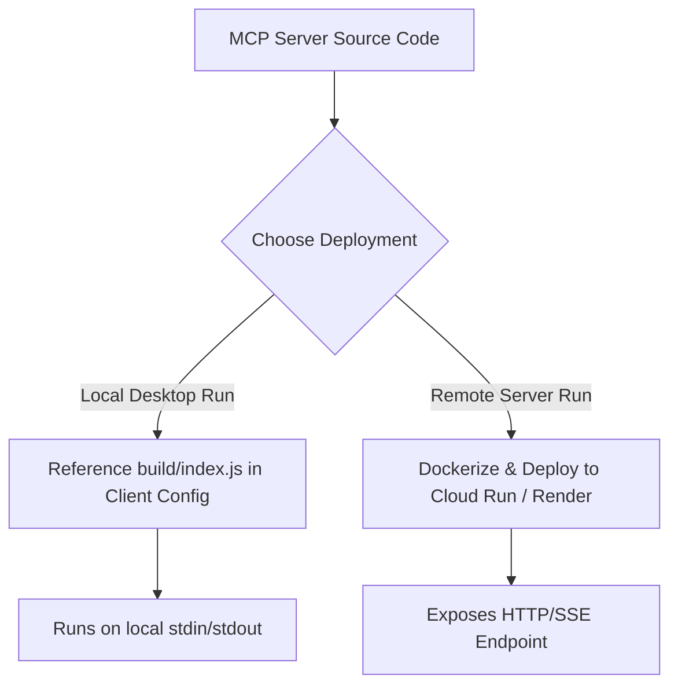

# Deployment Plan: Google Workspace MCP Server

This document outlines the strategies, step-by-step procedures, and security best practices for deploying the Google Workspace Model Context Protocol (MCP) server. 

Depending on your use case, you can deploy the server **locally** (via Git/Node.js) or **remotely** (via Docker & Cloud Hosting with Server-Sent Events).

---

## Deployment Strategies



---

## Strategy 1: Local Deployment (Recommended for Personal Use)

This is the fastest and most secure way to run the MCP server on your own computer (e.g., connected to Claude Desktop or Cursor).

### 1. clone & setup
Clone the repository to a persistent directory on your local machine:
```bash
git clone https://github.com/Shubham-vvn/MCP-server-01..git
cd MCP-server-01.
npm install
```

### 2. Configure Environment
Create the `.env` file and insert the credentials obtained during the authorization flow:
```ini
GOOGLE_CLIENT_ID=your_client_id
GOOGLE_CLIENT_SECRET=your_client_secret
GOOGLE_REDIRECT_URI=http://localhost:3000
GOOGLE_REFRESH_TOKEN=your_refresh_token
```

### 3. Build & Compile
Compile the TypeScript code to optimized JavaScript:
```bash
npm run build
```

### 4. Link with MCP Clients

#### Claude Desktop
Modify your `claude_desktop_config.json`:
* **Mac**: `~/Library/Application Support/Claude/claude_desktop_config.json`
* **Windows**: `%APPDATA%\Claude\claude_desktop_config.json`

```json
{
  "mcpServers": {
    "google-workspace-mcp": {
      "command": "node",
      "args": ["/absolute/path/to/MCP-server-01./build/index.js"],
      "env": {
        "GOOGLE_CLIENT_ID": "your_client_id",
        "GOOGLE_CLIENT_SECRET": "your_client_secret",
        "GOOGLE_REDIRECT_URI": "http://localhost:3000",
        "GOOGLE_REFRESH_TOKEN": "your_refresh_token"
      }
    }
  }
}
```

---

## Strategy 2: Remote Deployment to Railway (SSE Transport)

To deploy the MCP server remotely so multiple clients or cloud-based AI assistants can connect to it, you can host it as a web service on **Railway**. 

The server will automatically detect the `PORT` environment variable provided by Railway, switch from `stdio` transport to **Server-Sent Events (SSE)** transport, and expose a public HTTP endpoint.

### 1. Project Configuration
Railway will automatically detect that this is a Node.js project using **Nixpacks**. It will install dependencies, execute the `"build"` script from `package.json`, and run the `"start"` script (`node build/index.js`). No custom `Dockerfile` is required.

### 2. Deployment Steps
1. Log in to the [Railway Console](https://railway.app/).
2. Click **New Project** > **Deploy from GitHub repo**.
3. Select your repository: `MCP-server-01.`.
4. Click **Deploy Now**.
5. Once the service is created, go to **Settings** > **Public Networking** and click **Generate Domain** to get your public URL (e.g., `https://mcp-server-production.up.railway.app`).

### 3. Configure Environment Variables
In the **Variables** tab of your Railway service, add the following variables:
* `GOOGLE_CLIENT_ID`: Your Google OAuth Client ID.
* `GOOGLE_CLIENT_SECRET`: Your Google OAuth Client Secret.
* `GOOGLE_REDIRECT_URI`: `http://localhost:3000` (used during the initial authorization CLI).
* `GOOGLE_REFRESH_TOKEN`: The refresh token generated by the auth script.
* `PORT`: `3000` (or leave empty; Railway injects this automatically).

### 4. Connecting Clients to the Railway Server
To connect an MCP client (such as Claude Desktop or a custom LLM integration) to your deployed server, configure it to use the HTTP/SSE endpoints:
* **SSE Endpoint (GET)**: `https://your-service-name.up.railway.app/sse`
* **Message Endpoint (POST)**: `https://your-service-name.up.railway.app/messages`

#### Example client config (e.g., for SSE-compatible clients):
```json
{
  "mcpServers": {
    "google-workspace-mcp": {
      "type": "sse",
      "url": "https://your-service-name.up.railway.app/sse"
    }
  }
}
```

---

## Strategy 3: CI/CD Pipeline (GitHub Actions)

Add a GitHub Action workflow to automatically test, lint, and build the codebase on every push to the `main` branch.

Create a file named `.github/workflows/deploy.yml`:

```yaml
name: MCP Server CI

on:
  push:
    branches: [ main ]
  pull_request:
    branches: [ main ]

jobs:
  build:
    runs-on: ubuntu-latest

    steps:
    - name: Checkout repository
      uses: actions/checkout@v3

    - name: Set up Node.js
      uses: actions/setup-node@v3
      with:
        node-version: 18
        cache: 'npm'

    - name: Install dependencies
      run: npm ci

    - name: Build TypeScript
      run: npm run build
```

---

## Security Best Practices

> [!CAUTION]
> **Credential Leaks**: Ensure that `.env`, `tokens.json`, and `credentials.json` are **never** committed to public repositories. Always double-check your `.gitignore` settings before pushing code.

> [!IMPORTANT]
> **Minimal Scopes**: Do not add unnecessary permissions to your OAuth screen. Keep the scopes restricted strictly to `gmail.compose` and `documents` to minimize security footprints.
