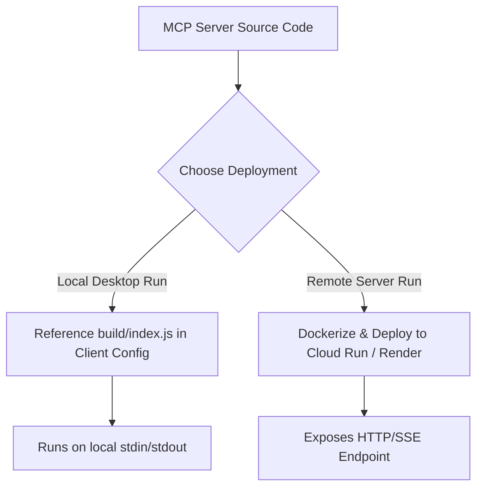

# Deployment Plan: Google Workspace MCP Server

This document outlines the strategies, step-by-step procedures, and security best practices for deploying the Google Workspace Model Context Protocol (MCP) server. 

Depending on your use case, you can deploy the server **locally** (via Git/Node.js) or **remotely** (via Docker & Cloud Hosting with Server-Sent Events).

---

## Deployment Strategies



---

## Strategy 1: Local Deployment (Recommended for Personal Use)

This is the fastest and most secure way to run the MCP server on your own computer (e.g., connected to Claude Desktop or Cursor).

### 1. clone & setup
Clone the repository to a persistent directory on your local machine:
```bash
git clone https://github.com/Shubham-vvn/MCP-server-01..git
cd MCP-server-01.
npm install
```

### 2. Configure Environment
Create the `.env` file and insert the credentials obtained during the authorization flow:
```ini
GOOGLE_CLIENT_ID=your_client_id
GOOGLE_CLIENT_SECRET=your_client_secret
GOOGLE_REDIRECT_URI=http://localhost:3000
GOOGLE_REFRESH_TOKEN=your_refresh_token
```

### 3. Build & Compile
Compile the TypeScript code to optimized JavaScript:
```bash
npm run build
```

### 4. Link with MCP Clients

#### Claude Desktop
Modify your `claude_desktop_config.json`:
* **Mac**: `~/Library/Application Support/Claude/claude_desktop_config.json`
* **Windows**: `%APPDATA%\Claude\claude_desktop_config.json`

```json
{
  "mcpServers": {
    "google-workspace-mcp": {
      "command": "node",
      "args": ["/absolute/path/to/MCP-server-01./build/index.js"],
      "env": {
        "GOOGLE_CLIENT_ID": "your_client_id",
        "GOOGLE_CLIENT_SECRET": "your_client_secret",
        "GOOGLE_REDIRECT_URI": "http://localhost:3000",
        "GOOGLE_REFRESH_TOKEN": "your_refresh_token"
      }
    }
  }
}
```

---

## Strategy 2: Remote / Containerized Deployment (For Teams)

For teams or remote clients accessing the MCP server over the internet, you can package the server in a Docker container and expose it using Server-Sent Events (SSE).

### 1. Create a `Dockerfile`
Create a `Dockerfile` in the root of the project to package the runtime:

```dockerfile
# Build phase
FROM node:18-alpine AS builder
WORKDIR /app
COPY package*.json tsconfig.json ./
RUN npm ci
COPY src ./src
RUN npm run build

# Runtime phase
FROM node:18-alpine AS runner
WORKDIR /app
ENV NODE_ENV=production
COPY package*.json ./
RUN npm ci --only=production
COPY --from=builder /app/build ./build

# SSE uses HTTP port
EXPOSE 3000
CMD ["node", "build/index.js"]
```

> [!NOTE]
> When running remotely, you must refactor `src/index.ts` to use `SSEServerTransport` instead of `StdioServerTransport`.

### 2. Cloud Deployment Providers
You can host the Docker container on any container-compatible cloud service:
* **Render / Railway**: Easiest way to connect your GitHub repository and automatically trigger builds upon pushing to `main`.
* **Google Cloud Run**: Highly scalable serverless container runner.

### 3. Injecting Environment Variables
Never upload `.env` files to cloud platforms. Instead, configure the variables directly in the provider's management console:
* `GOOGLE_CLIENT_ID`
* `GOOGLE_CLIENT_SECRET`
* `GOOGLE_REDIRECT_URI`
* `GOOGLE_REFRESH_TOKEN`

---

## Strategy 3: CI/CD Pipeline (GitHub Actions)

Add a GitHub Action workflow to automatically test, lint, and build the codebase on every push to the `main` branch.

Create a file named `.github/workflows/deploy.yml`:

```yaml
name: MCP Server CI

on:
  push:
    branches: [ main ]
  pull_request:
    branches: [ main ]

jobs:
  build:
    runs-on: ubuntu-latest

    steps:
    - name: Checkout repository
      uses: actions/checkout@v3

    - name: Set up Node.js
      uses: actions/setup-node@v3
      with:
        node-version: 18
        cache: 'npm'

    - name: Install dependencies
      run: npm ci

    - name: Build TypeScript
      run: npm run build
```

---

## Security Best Practices

> [!CAUTION]
> **Credential Leaks**: Ensure that `.env`, `tokens.json`, and `credentials.json` are **never** committed to public repositories. Always double-check your `.gitignore` settings before pushing code.

> [!IMPORTANT]
> **Minimal Scopes**: Do not add unnecessary permissions to your OAuth screen. Keep the scopes restricted strictly to `gmail.compose` and `documents` to minimize security footprints.
